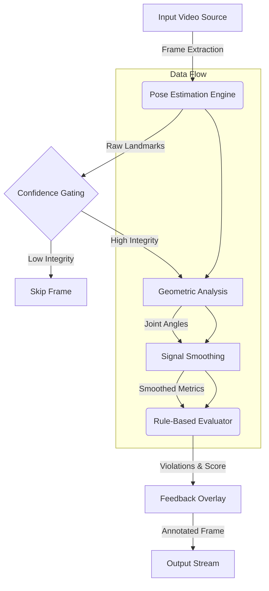

# Mediapipe AI Form Detector


## Overview

The Mediapipe AI Form Detection System is a computer vision pipeline designed to analyze human movement patterns and provide real-time, deterministic feedback on exercise performance. Leveraging Google MediaPipe for pose estimation and OpenCV for video processing, this system implements a rule-based engine to evaluate biomechanics against established kinesiological standards.

The current implementation focuses on Right Bicep Curls and Lateral Raises using the MM-Fit dataset as a benchmark, delivering frame-by-frame corrective feedback, kinematic angles, and performance scoring.


---

## Visual Demo

> **Note**: To view the full real-time analysis, please see the demonstrations below.

### Bicep Curl Analysis
[](https://github.com/SWETANKSINHA23/mediapipe_ai_form_detector/blob/main/output_videos/bicep_curl_output.mp4)

### Lateral Raise Analysis
[](https://github.com/SWETANKSINHA23/mediapipe_ai_form_detector/blob/main/output_videos/lateral_raise_output.mp4)

---


## System Architecture

The system follows a modular, pipelined architecture designed for scalability and maintainability.



---

## Technology Stack

| Component | Technology | Description |
| :--- | :--- | :--- |
| **Language** | Python 3.8+ | Core logic and pipeline orchestration. |
| **Vision Backend** | OpenCV (cv2) | Image processing, video I/O, canvas rendering. |
| **Pose Estimation** | Google MediaPipe | High-fidelity 33-point skeletal tracking (BlazePose). |
| **Math & Data** | NumPy | Vectorized geometric calculations and signal processing. |
| **Smoothing** | SciPy / Custom | Rolling averages and Savitzky-Golay filtering for jitter reduction. |

---

## System Capabilities

-   **High-Fidelity Pose Tracking**: Utilizes MediaPipe's topology model to track 33 3D landmarks with sub-degree angular precision.
-   **Deterministic Rule Engine**:
    -   **Bicep Curls**: Monitors elbow flexion (ROM checks), torso stability (anti-momentum), and shoulder placement.
    -   **Lateral Raises**: Evaluates abduction angles (shoulder height), elbow locking prevention, and trunk neutrality.
-   **Signal Stabilization**: Implements time-series smoothing to eliminate sensor noise and high-frequency jitter, ensuring distinct feedback states.
-   **Real-Time HUD (Head-Up Display)**:
    -   **Live Skeleton**: Color-coded connections indicating detection quality.
    -   **Dynamic Status Bar**: Instant visual cues for rapid user correction.
    -   **Metric Dashboard**: Live readouts of critical joint angles.
-   **Automated Dataset Processing**: Parsing pipelines to segment continuous workout streams (e.g., MM-Fit `w06_rgb.mp4`).

---

## Biomechanical Analysis Engine

The core of the system is a deterministic, rule-based evaluator grounded in kinesiological standards. This approach ensures explainability and precise, actionable feedback.

### 1. Analysis Logic & Smoothing
*   **Vector Geometry**: Joint angles are computed using dot product kinematics on normalized 3D vectors.
*   **Signal Smoothing**: Raw MediaPipe output often contains high-frequency jitter. A Simple Moving Average (SMA) (window=5) is implemented to stabilize the signal, preventing feedback flickering during borderline repetitions.

### 2. Posture Rules

#### Bicep Curl
*   **Full Range of Motion (ROM)**:
    *   *Extension*: Angle > 160 degrees (Full Stretch).
    *   *Contraction*: Angle < 50 degrees (Peak Flexion).
*   **Momentum Control**: Tracking shoulder x-variance. Excessive anterior/posterior shift indicates use of momentum by swinging the torso.

#### Lateral Raise
*   **Target Abduction**: 85 - 100 degrees shoulder angle.
*   **Impingement Safety**: Angles > 105 degrees trigger a "Too High" warning.
*   **Elbow Integrity**: Elbow angle must remain between 150-170 degrees (slight bend) to prevent joint stress.

---

## Engineering Challenges And Solutions

### Multiple Subject Handling
Gym environments are dynamic. To robustly handle multiple persons in the frame:
*   **Confidence Gating**: The system filters secondary subjects by prioritizing the skeleton with the highest average landmark visibility and bounding box area (proximity heuristic).
*   **Focus Lock**: Once a subject is verified, the system ignores transient background detections to prevent focus switching.

### Occlusion And Perspective
*   **Self-Occlusion**: During movements like curls, the forearm may obscure the torso. The system uses a state buffer to maintain tracking continuity during frame drops.
*   **2D Projection Constraints**: Since the system relies on monocular RGB video, extreme side profiles can skew angle calculations. The current projection logic optimizes for a standard 3/4 view.

---

## Project Deliverables

This repository is structured to meet submission criteria:

*   **Source Code**: Full Python implementation in `src/`.
*   **Analysis Script**: `src/form_evaluation.py` containing the rule engine.
*   **Video Overlay**: Processed artifacts in `output_videos/` demonstrating real-time feedback.
*   **Documentation**: Technical documentation of rules and logic (README).

---

## Project Structure

```text
mediapipe_ai_form_detector/
├── data/
│   ├── raw/                 # Source footage
│   └── processed/           # Extracted exercise-specific clips
├── output_videos/           # Final rendered analysis artifacts
├── src/
│   ├── main.py              # Application entry point
│   ├── pipeline.py          # Core processing orchestration
│   ├── pose_detection.py    # MediaPipe abstraction layer
│   ├── form_evaluation.py   # Biomechanical rule definitions
│   └── auto_extract_exercises.py # Clip segmentation utility
├── tests/                   # Unit and integration test suite
├── utils/
│   ├── angle_calculator.py  # Vector geometry library
│   ├── smoothing.py         # Signal processing filters
│   └── visualizer.py        # Canvas rendering engine
├── requirements.txt         # Dependency manifest
└── README.md                # System documentation
```

---

## Installation And Setup

### Prerequisites
-   Python 3.8 or higher
-   pip package manager

### 1. Clone And Configure
```bash
# Clone repository
git clone https://github.com/SWETANKSINHA23/mediapipe_ai_form_detector.git
cd mediapipe_ai_form_detector

# Initialize virtual environment
python -m venv .venv

# Activate environment
# Windows:
.venv\Scripts\activate
# Linux/Mac:
source .venv/bin/activate
```

### 2. Install Dependencies
```bash
pip install -r requirements.txt
```

### 3. Data Ingestion
Download the MM-Fit dataset sample (`w06_rgb.mp4`) and place it in the ingestion directory:
```text
data/raw/w06_rgb.mp4
```

---

## Usage Guidelines

### Automated Pipeline
Calculates clips, runs analysis, and generates reports.

```bash
python src/main.py
```

### Utility: Clip Extraction
To regenerate specific exercise clips from raw footage:

```bash
python src/auto_extract_exercises.py
```

### Verification Suite
Run the test harness to validate system integrity:

```bash
python tests/test_pipeline.py
```

---

## Outputs

The system generates artifacts in `output_videos/`:

| Artifact | Description |
| :--- | :--- |
| **`bicep_curl_output.mp4`** | Full session analysis with overlays. |
| **`lateral_raise_output.mp4`** | Annotated lateral raise session showing angular limits. |
